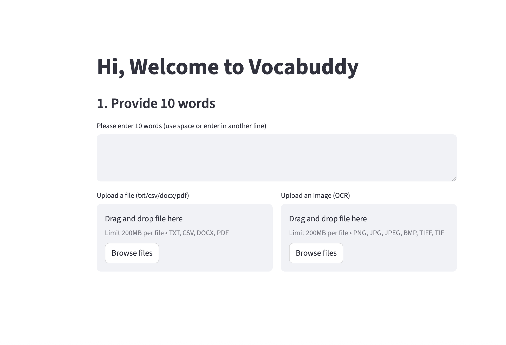

# Vocabuddy
link ：https://vocabuddy-m2as5vrgtbq3jsdxqu2dpp.streamlit.app/

Vocabuddy is an interactive vocabulary learning web application built with **Python** and **Streamlit**, developed as a **course project**. Many English learners lack guided, engaging practice for self-study and teachers also face chellenge to offer extra support for learners practice outside the classroom. Vocabuddy is designed to help English learners practice vocabulary through multiple game-based activities that explicitly target **form, sound, meaning, and usage**, drawing on core principles from vocabulary acquisition and linguistics.

The app allows users to upload their own word lists (or extract words from documents) and immediately practice them through engaging mini-games.

---

## ✨ Features

### 1. Multiple Vocabulary Games

Vocabuddy currently includes four main game modes:

* **Scrambled Letters Game**
  Practice word *form* by rearranging scrambled letters to spell the correct word.

* **Matching Game**
  Strengthen word *meaning* by matching words with their definitions.

* **Listen & Choose Game**
  Focus on *listening and pronunciation*. Users listen to an audio pronunciation and choose the correct word.

* **Fill-in-the-Blank Usage Game**
  Learners practice word usage by completing a sentence with the correct target word. Example sentences are retrieved via the Merriam-Webster Dictionary API.
(If the API does not return a suitable example sentence for a target word, the system automatically applies a fallback sentence to ensure gameplay continuity and consistency across all words.)
---

## 📁 Input Options

Users can provide vocabulary in several ways:

* Manually input words
* Upload files such as:

  * `.txt`
  * `.docx`
  * `.pdf`
  * Images (via OCR)

The system automatically extracts text and builds a vocabulary list for gameplay.

---

## 🔊 Audio Support

* Word pronunciations are generated using **gTTS** (Google Text-to-Speech)
* Audio files are cached locally for efficiency

---

## 🛠️ Tech Stack

* **Python 3**
* **Streamlit** (web interface)
* **pandas** (data handling)
* **gTTS** (text-to-speech)
* **PyPDF2**, **python-docx**, **Pillow**, **pytesseract** (file & OCR processing)
* Optional dictionary APIs for definitions and example sentences

---

## 🚀 Installation & Running the App

1. Clone the repository:

```bash
git clone https://github.com/wuyuechang11/Vocabuddy.git
cd vocabuddy
```

2. Create and activate a virtual environment:

```bash
python -m venv .venv
source .venv/bin/activate  # macOS/Linux
.venv\\Scripts\\activate     # Windows
```

3. Install dependencies:

```bash
pip install -r requirements.txt
```

4. Run the Streamlit app:

```bash
streamlit run webversion.py
```
Homepage


Read files


Choose game mode


Play the game


Game Result


---

## 📌 Project Motivation & Academic Context

Vocabuddy was developed as a course project and collaborative learning experience with the goal of:

* Exploring how technology can support vocabulary acquisition
* Designing game-based activities that reflect linguistic principles
* Practicing collaborative software development

---

## ⚠️ Current Limitations

* The UI design is minimal and focuses on functionality over aesthetics
* Vocabulary usage practice is limited to predefined formats
* External dictionary API coverage and rate limits may affect availability of example sentences

---

## 🔮 Future Improvements

* Enhanced UI/UX design
* More adaptive difficulty levels
* Expand usage practice to include multiple-sentence or discourse-level contexts
* User progress tracking and analytics

---

## 🤝 Collaboration & Course Learning Outcomes

This project emphasizes collaboration as part of the course learning objectives:

* Clear and readable code is essential
* Team members negotiate design decisions together
* Collaboration enables faster problem-solving and shared learning

---

## 📄 Academic Use & License

This project is created for academic and educational purposes. It is not intended for commercial use. Licensing information can be added if the project is released publicly in the future.
